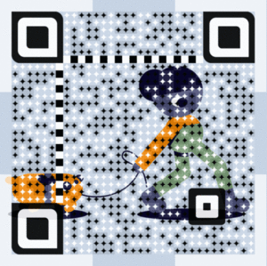

## **写在前面**
&emsp;&emsp;其实，这篇博客是自己下定决心，准备好好静下心来，对自己在工作和生活中的点滴做一个记录，而并非是一个真正意义的博客。
下面我就对自己的工作和生活做一个简单的回顾和总结,也是对前一个阶段打一个印记，为的是下一个阶段的更好开展。  

## **Work**
&emsp;&emsp;截止到今天，毕业两年零三个月，说多不多，说少也不少。
研究生阶段主要参与的是大数据相关的项目，毕业出于某种原因去了北京，放弃了到手自己喜欢的公司offer，而且岗位不是自己喜欢的方向，
后来发现，自己当初的冲动决定是多么的无脑和幼稚。曾经设想回到原来的城市，至少当时理想在那里，却发现现在已经没有当初那种一定要留下的情愫，无奈之下，
硬着头皮呆了下来，安慰自己说北京离家近，哈哈。不满于现状，想要重新做回自己，索性换了一家互联网公司，想着让自己忙起来，或许可以让自己过的更充实
一点。自己也算努力，搁置一年的大数据开发又找到了那种久违的感觉，做着自己喜欢的工作，每天都很开心。庆幸的是，一直到现在，我都还有这种感觉，工作还算开心。

&emsp;&emsp;对我来说，工作想要保持热情，兴趣真的占有很高的权重，然后才是金钱。发挥自己的优势，金钱也就顺理成章的来。
  

## **Life**
&emsp;&emsp;脱离校园后的生活，我觉得变化最大的就是自己的身体，当然是往好的方面发展，虽然身体略微发福，但也在正常范围内，
而且多了几分精壮，毕竟自己几乎每晚都做俯卧撑（50+/min, ~ ~），以及隔三差五的去公司附近的天然氧吧跑步(5km-6km/30min, ~ ~)，自律是对自己最好的礼物，不仅仅是身体这方面。
感情总体上还算顺利，好朋友以及同事之间也相处融洽，忙的时候互不打扰，闲的时候，伙同一块出去各种浪，已然忘记我们已经是奔三的大孩子了，这种相处模式看来
不失为一种较好的生活相处方式。总之，以后在对的人身上，会继续多付出，也要对自己好一点。希望自己的身体会一直这样下去，毕竟从事互联网行业，对自己不好真的
会死人（~ ~，哈哈）。

&emsp;&emsp;生活上想要顺心，自律不失为一种简单的方式，但需要毅力。
 

## **Next**
&emsp;&emsp;接下来，需要对重点对自己的工作做一些规划，让工作为生活更好的服务，
也为了让自己更加开心。未来的路，由自己决定，能走多远，尽力就行。
 

## **Last**
&emsp;&emsp;人生如游戏，当你遇到敌人的时候，就说明方向走对了。

&emsp;&emsp;**Email**: ke.luckystone@gmail.com

**微信公众号**：      
    

